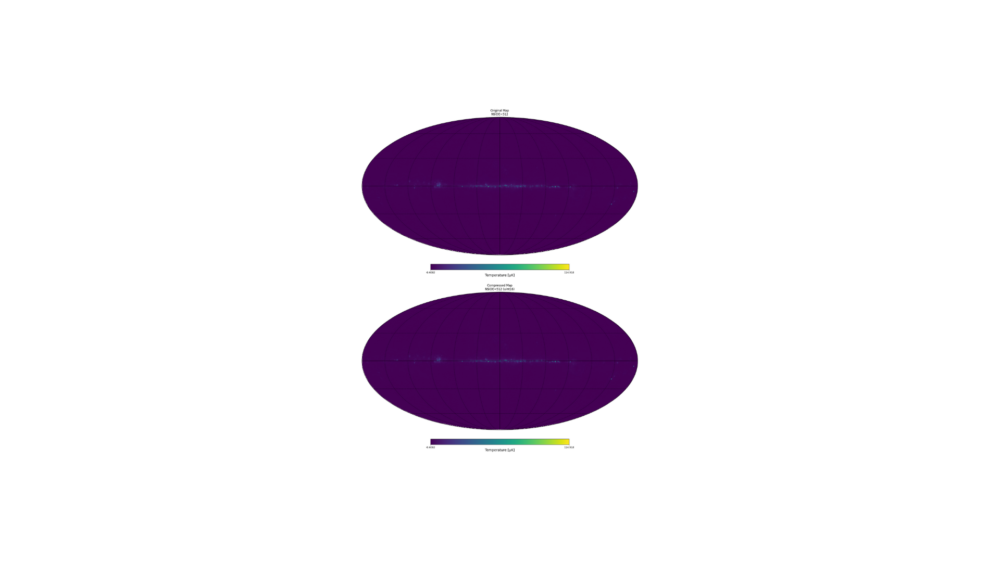

# HEALPix Map Compression and Visualization Project

This project provides a Python-based toolset for compressing, decompressing, and visualizing HEALPix maps. It is designed to handle high-resolution HEALPix maps efficiently, reducing their size while preserving their scientific fidelity. The project is particularly useful for machine learning workflows where large HEALPix maps need to be processed without excessive memory usage.

---

## What Does the Code Do?

### Compression
The compression function performs the following steps:
1. **Downsampling**: Reduces the resolution of the HEALPix map using the `ud_grade` function from the `healpy` library. This step lowers the `NSIDE` parameter, reducing the number of pixels in the map.
2. **Quantization**: Converts the floating-point data to a lower bit-depth (e.g., `uint16` or `uint8`) to save memory. The data is scaled to fit the range of the target data type.
3. **HDF5 Storage**: Saves the compressed map in an HDF5 file with lossless compression (gzip). Metadata, such as the original and current `NSIDE`, is also stored for reconstruction.

#### How Compression Works:
- **Input**: A HEALPix map in FITS format.
- **Output**: A compressed HDF5 file containing the downsampled and quantized map, along with metadata.

### Decompression
The decompression function performs the following steps:
1. **Read HDF5 File**: Loads the compressed map and metadata from the HDF5 file.
2. **Reconstruct Data**: Scales the quantized data back to its original range using the stored metadata.
3. **Preserve NaN Values**: Ensures that missing data (NaN values) in the original map are preserved.

#### How Decompression Works:
- **Input**: A compressed HDF5 file.
- **Output**: A reconstructed HEALPix map in its original format, ready for analysis or visualization.

---

## Project Structure

The project is organized into the following directories and files:
```
healpix_project/
│
├── main.py
├── healpix_processor.py 
├── visualization.py 
├── requirements.txt
├── compressed_files/
├── FITS_files/
├── notebooks/
└── README.md 
```
---

## How to Run the Code

### Prerequisites
1. Install the required dependencies:
   ```bash
   pip install -r requirements.txt
   ```
2. Place your HEALPix FITS files in the FITS_files/directory.

# Example: Compressing and Visualizing a HEALPix Map

## Step 1: Compress a HEALPix Map

Run the following command to compress a HEALPix map:
```py
python main.py FITS_files/wmap_highres.fits --output_h5 compressed_files/compressed_map.h5 --target_nside 1024 --dtype uint16
```
- Input File: FITS_files/wmap_highres.fits
- Output File: compressed_files/compressed_map.h5
- Target NSIDE: 1024 (reduces resolution)
- Data Type: uint16 (16-bit quantization)

## Step 2: Visualize the Original and Compressed Maps
To visualize the original and compressed maps side-by-side, add the --visualize flag:
```py
python main.py FITS_files/wmap_highres.fits --output_h5 compressed_files/compressed_map.h5 --target_nside 1024 --dtype uint16 --visualize
```
This will:

1. Compress the map (if not already compressed).
2. Display a figure with two panels:
   - Left: Original high-resolution map.
   - Right: Compressed map with lower resolution and quantization.

## Example Output



### Visualization
The visualization script generates a figure with two Mollweide projections:

- Original Map: Displays the full-resolution HEALPix map.
- Compressed Map: Displays the downsampled and quantized version.

# Compressed File
The compressed file is stored in the compressed_files/ directory as an HDF5 file. It includes:

- The compressed map data.
- Metadata such as the original and current NSIDE, data type, and scaling factors.

# Customization
## Compression Parameters
--target_nside: Adjust the resolution of the compressed map. Lower values result in smaller files but less detail.

--dtype: Choose the data type for quantization (uint8, uint16, or float32).

## Visualization
Modify visualization.py to customize the plot (e.g., change color maps, titles, or layout).

# Notes
Ensure the healpy library is installed and up-to-date (pip install --upgrade healpy).

Use the notebooks/ directory for exploratory analysis or additional visualizations.

# License
This project is open-source and available under the MIT License. Feel free to use, modify, and distribute it as needed.
